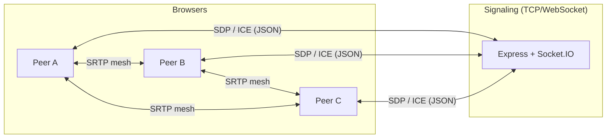

# Closr

Built on top of https://github.com/hkirat/omegle with a cleaner UI.

Closr is a browser-based group video calling app for casual hangouts—study sessions, game nights, or quick catch-ups. No accounts, no install, no ads. Media flows peer-to-peer when the network allows; the backend only handles signaling and room state.

## What you can do

- Create a room and copy an **invite link** (`?room=` + `?t=`) for others to join
- Join by pasting the full invite URL (room code alone is not enough)
- See everyone in a responsive video grid (rows on mobile, columns on desktop)
- Open the **People** panel: name list when no one is sharing; camera thumbnails during screen share
- Share your screen (**one sharer at a time**; a new share replaces the current one)
- Mute mic or turn off camera from the control bar
- **Lock the room** (host) so only people who already joined can return; new guests are blocked
- Reconnect after refresh or brief network loss without creating a duplicate room

---

## Legal disclaimer gating

Closr is a P2P conduit: **servers never stream, proxy, cache, or store media.**

The frontend shows a **mandatory legal disclaimer modal on every page load** (acceptance is session-only in React state—no `localStorage` persistence). Users must acknowledge terms before using the app. Production deployments should keep this wall enabled.

---

## Architecture overview



| Plane | Role |
|--------|------|
| **Signaling** | Socket.IO over HTTP(S). Forwards SDP/ICE and room events only. |
| **Media** | Full mesh: each browser holds up to **N − 1** `RTCPeerConnection`s and sends streams to every other peer. |

---

## Stack

| Layer | Technology |
|--------|------------|
| Frontend | React 18, TypeScript, Vite, react-router-dom, Google Material Symbols |
| Signaling | socket.io-client ↔ socket.io (WebSocket with long-polling fallback) |
| Backend | Node.js, Express, Socket.IO |
| Media | WebRTC (`RTCPeerConnection`), `getUserMedia`, `getDisplayMedia` |

---

## Signaling (Socket.IO)

### Client → server

| Event | Purpose |
|--------|---------|
| `create-room` | Host creates a room (`name`, `clientId`) |
| `join-room` | Guest/host joins (`roomId`, `inviteToken` and/or legacy `roomSecret`, `clientId`) |
| `lock-room` | Host toggles room lock |
| `offer` / `answer` / `ice-candidate` | WebRTC negotiation (`roomId`, `targetId`, payload) |
| `screen-share-status` | Broadcast who is sharing and optional `trackId` metadata |
| `leave-room` | Explicit leave |

### Server → client

| Event | Purpose |
|--------|---------|
| `room-created` | `roomId`, `roomSecret`, `inviteToken`, `isHost` |
| `room-joined` | Existing peers + `isHost` |
| `participant-joined` / `participant-left` | Membership updates |
| `invite-token-refreshed` | New short-lived token after join |
| `room-locked` | Lock state broadcast |
| `room-join-error` / `room-lock-error` | User-facing errors |
| `screen-share-status` | Remote share state (`senderId`, `isSharing`, `trackId`, `activeSharerId`) |
| `screen-share-revoked` | Previous sharer stopped because someone else took over |
| `offer` / `answer` / `ice-candidate` | Forwarded to `targetId` |

HTTP endpoints: `GET /` (health text), `GET /health` (JSON, used by Render).

Socket.IO tuning: `pingInterval` 10s, `pingTimeout` 20s. On disconnect, removal is **deferred 25s** so tabs can reconnect without dropping the room immediately.

---

## WebRTC & ICE

Configuration lives in `frontend/src/lib/webrtc.ts` (`getPeerConnectionConfig()`).

| Setting | Value |
|---------|--------|
| STUN | Google + Cloudflare public STUN servers |
| TURN (optional) | `VITE_TURN_URL`, `VITE_TURN_USERNAME`, `VITE_TURN_CREDENTIAL` at build time |
| TURN (prod fallback) | Public Metered Open Relay when custom TURN is not set |
| `iceCandidatePoolSize` | `8` |
| Bundle / mux | `max-bundle`, `require` |

**ICE in practice:** STUN discovers reflexive candidates; when UDP P2P fails (symmetric NAT, strict firewalls, mobile, international links), **TURN relays** media. For production reliability, configure your own TURN service rather than relying on the public fallback.

**SDP glare:** Polite peer rule uses lexicographic `socket.id` comparison; the polite side rolls back before applying a conflicting remote offer.

**Signaling identity:** WebRTC messages use **Socket.IO `socket.id`** as `fromId` / `targetId`. A separate **`clientId` (UUID)** ties reconnects and host privileges across socket replacements.

---

## Media behavior (frontend)

- **Camera/mic:** `getUserMedia` on the landing page; tracks attached per peer connection.
- **Screen share:** `getDisplayMedia`; secondary video with encoder hints (`contentHint: "detail"`, capped FPS/bitrate where supported). Shared content uses **`object-fit: contain`** so slides are not cropped.
- **Exclusive share:** Server tracks one `screenSharerId`; starting share revokes the previous sharer (`screen-share-revoked`).
- **Mixed outbound audio:** Mic + system/tab audio can be merged via `AudioContext` → `MediaStreamDestination` when both are active.
- **Track metadata:** `screen-share-status` helps the UI pick the correct remote video track when IDs differ across peers.

---

## Room model & security (server)

Rooms are in-memory maps (`RoomManager`); restart clears state.

| Concept | Behavior |
|---------|----------|
| **Room ID** | 8-character Crockford-style alphabet (no ambiguous `0/O/1/I`) |
| **Room secret** | 48-hex host key; stored as **scrypt** hash (`INVITE_SIGNING_KEY` pepper) |
| **Invite token** | HMAC-signed, base64url payload in URL (`?t=`); default TTL **24h**; refreshed on join |
| **Host** | `clientId` stored at create time; only host may `lock-room` |
| **Guest identity** | Per-tab UUID in `sessionStorage` (two tabs = two guests) |
| **Host identity** | Stable UUID in `localStorage` (survives refresh) |
| **Reconnect** | Same `clientId` evicts the old socket for that client in the room |
| **Lock** | Blocks **new** guests; host and `knownClientIds` may rejoin |
| **Capacity** | `ROOM_MAX_PARTICIPANTS` (default **12**) |
| **Lifetime** | Sliding `ROOM_MAX_LIFETIME_MS` (default **4h**) while active; empty rooms pruned after `ROOM_EMPTY_TTL_MS` (default **5m**) |
| **Rate limits** | In-memory limiter on create/join per IP/socket; failed joins penalized |

Join failures use generic copy for `not_found` / `forbidden` to reduce room enumeration.

Production requires **`INVITE_SIGNING_KEY`** (≥16 bytes recommended; `openssl rand -hex 32`). **`ALLOWED_ORIGINS`** restricts Socket.IO CORS to your frontend origin(s).

---

## Frontend session & invites

- **Invite URL:** `https://<app>/?room=XXXXXXXX&t=<token>` (legacy `?key=` still supported for host secret).
- **Join flow:** Single paste field; `parseInviteLinkInput()` rejects room codes without a token/key.
- **Active room:** `sessionStorage` remembers the current room so socket reconnects call `join-room` instead of `create-room`.
- **Secrets:** Host room key in `sessionStorage`; invite tokens cached per room id.

---

## UI layout

- **Default:** CSS grid of participant tiles; mobile uses stacked rows (`<769px`), desktop uses columns.
- **Screen share:** Main stage shows the shared display (`contain`); sidebar shows live camera thumbnails when **People** is open.
- **No screen share + People:** Narrow sidebar with participant **names** only (local user tagged “You”).
- **Connection badge:** `connecting` / `connected` / `reconnecting` with Socket.IO auto-reconnect.

---

## Configuration

### Backend (`backend/.env` — see `backend/.env.example`)

| Variable | Default | Purpose |
|----------|---------|---------|
| `INVITE_SIGNING_KEY` | — | **Required in production.** HMAC + scrypt pepper |
| `ALLOWED_ORIGINS` | `*` if unset | Comma-separated frontend origins for CORS |
| `PORT` | `3000` | HTTP / Socket.IO port |
| `ROOM_MAX_PARTICIPANTS` | `12` | Max peers per room |
| `ROOM_MAX_LIFETIME_MS` | `14400000` (4h) | Sliding room expiry |
| `ROOM_EMPTY_TTL_MS` | `300000` (5m) | Delete empty rooms after idle |

### Frontend (Vite env at build time)

| Variable | Purpose |
|----------|---------|
| `VITE_BACKEND_URL` | Signaling server origin (e.g. `https://closr-signaling.onrender.com`) |
| `VITE_TURN_URL` | Optional TURN URL(s), comma-separated |
| `VITE_TURN_USERNAME` | TURN username |
| `VITE_TURN_CREDENTIAL` | TURN credential |

---

## Local development

**Backend**

```bash
cd backend
cp .env.example .env   # set INVITE_SIGNING_KEY for realistic invite tokens
npm install
npm run dev
```

**Frontend**

```bash
cd frontend
npm install
npm run dev
```

Point `VITE_BACKEND_URL` at the signaling server if it is not `http://localhost:3000`.

**Root:** `npm run build` / `npm run start` compile and run the backend from the repo root.

If port 3000 is in use: `lsof -ti :3000 | xargs kill` (or change `PORT`).

---

## Deployment

| Service | Suggested host | Notes |
|---------|----------------|-------|
| Signaling | [Render](https://render.com) | `render.yaml` blueprint; set `INVITE_SIGNING_KEY`, `ALLOWED_ORIGINS`; health check `/health` |
| Frontend | [Vercel](https://vercel.com) | Set `VITE_BACKEND_URL`; optional TURN vars for production |

Both need **HTTPS** for camera, microphone, and display capture in real browsers.

Example Render env:

- `INVITE_SIGNING_KEY` — `openssl rand -hex 32`
- `ALLOWED_ORIGINS` — `https://your-app.vercel.app`

---

## Limitations

- **Mesh scaling:** Upload/encode cost grows with peer count; not suited for large webinars (use an SFU instead).
- **No persistence:** Rooms and presence are memory-only.
- **TURN:** Public relay is a fallback; dedicated TURN is recommended for mobile and cross-region calls.
- **Same `clientId` in two tabs:** The newer connection evicts the older one (by design for reconnect, confusing if you open two host tabs).

---

## License

See package metadata in `frontend/` and `backend/` (ISC where noted).
