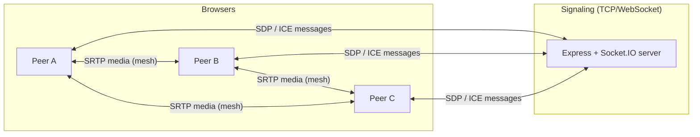

# Closr

This project is built on top of https://github.com/hkirat/omegle with a cleaner UI.

Closr is a simple group video calling app for talking with friends in the browser.

Pick a name, create a room or open an invite link, and you’re in—no accounts, no install, and no ads. Video and audio go directly between participants when your network allows it, so calls stay private and low-latency for small groups.

What you can do


Start a room and share an invite link so others can join


See everyone in a clean grid or a focused screen-share layout


Share your screen (one person at a time)


Mute your mic or turn off your camera from simple controls


Lock the room so only people who already joined can come back (host)

Closr is built for casual hangouts—study sessions, game nights, or quick catch-ups—not large webinars or enterprise meetings.

---

---

## ⚖️ Legal Notice & Content Disclaimer Gating

Closr functions purely as an intermediary, real-time communications tool. Because the platform uses a **peer-to-peer full-mesh architecture**, all video, audio, and screen-sharing data flows directly between users' browsers. 

**Closr servers never stream, proxy, cache, or store media content.** 

To insulate the platform and its developers from liability under third-party copyright claims (e.g., Netflix, YouTube, TikTok), **the frontend application enforces a mandatory legal disclaimer modal on initial site load.** 

### Mandatory Compliance Rules:
1. **No Endorsement:** Closr does not provide access to, index, or curate any third-party streaming media.
2. **User Liability:** Users assume sole legal responsibility for any content they choose to broadcast or display via the screen-sharing feature.
3. **P2P Transparency:** The disclaimer explicitly clarifies that the app functions identically to enterprise utilities like Zoom or Google Meet, acting purely as a conduit for user-generated data.

Production deployments **must** keep this acknowledgment wall active to prevent users from interacting with the signaling plane before agreeing to the terms.

## Architecture overview



- **Signaling plane:** Each client opens a Socket.IO connection to the backend. The server **does not** proxy WebRTC media; it only forwards JSON messages (`offer`, `answer`, `ice-candidate`, room events).
- **Media plane:** For \(N\) participants in a room, each browser maintains up to **\(N - 1\) `RTCPeerConnection`s**—a **full mesh**. Every participant sends their streams to every other participant independently.

---

## Stack

| Layer | Technology |
|--------|------------|
| Frontend | React 18, TypeScript, Vite, react-router-dom |
| Real-time signaling | socket.io-client ↔ socket.io (WebSocket/long-polling fallback) |
| Backend | Node.js, Express, Socket.IO server |
| Media APIs | WebRTC (`RTCPeerConnection`), `getUserMedia`; optional secondary capture APIs where used |

---

## Connection types

### 1. Socket.IO (signaling)

Persistent bidirectional channel used only for:

- Room lifecycle (`create-room`, `join-room`, `room-created`, `room-joined`, `participant-joined`, `participant-left`, `room-join-error`).
- WebRTC negotiation (`offer`, `answer`, `ice-candidate`), addressed **per peer** using `targetId` / `fromId`.
- Optional track metadata (`screen-share-status`) so the UI knows **which remote video track is the secondary feed** versus the primary camera.

The HTTP server also exposes:

- `GET /` — plain-text health message
- `GET /health` — JSON `{ status, timestamp }` (useful for platforms like Railway)

### 2. WebRTC peer connections (media)

Each `(local peer ↔ remote peer)` pair uses one **`RTCPeerConnection`** with:

| Setting | Value |
|---------|--------|
| ICE servers | Public STUN: `stun:stun.l.google.com:19302` |
| Bundle | `bundlePolicy: "max-bundle"` |
| RTCP mux | `rtcpMuxPolicy: "require"` |

**Offer/answer glare:** Incoming offers use a **polite peer** rule (`socket.id` string comparison): on SDP collision, the polite side rolls back locally before applying the remote offer.

**Important:** There is **no TURN server** in this repo. Calls work best on networks where UDP flows peer-to-peer (e.g. same LAN). Symmetric NATs, strict firewalls, or some mobile networks may fail or be flaky without **TURN** (relay) credentials added to `iceServers`.

---

## Media implementation notes

- **Primary call audio/video:** From `getUserMedia` on the landing page; attached as senders on each peer connection.
- **Optional second outgoing video:** From display/tab capture APIs when the user chooses to present; surfaced as an additional track alongside the camera.
- **Mixed outbound audio:** When mic and capture audio are both active they can be combined via **`AudioContext`** → **`MediaStreamDestination`** → one outbound audio track.

Encoder tuning on the secondary video path (where applicable) sets **`contentHint: "detail"`**, caps FPS/resolution when the platform honors it, and adjusts RTP **`maxFramerate`**, **`maxBitrate`**, and **`degradationPreference: "maintain-framerate"`**.

---

## Room model (server)

- Rooms are keyed by string IDs generated server-side (`RoomManager`).
- Participants are keyed by **Socket.IO socket id** (ties signaling identity to WebRTC `targetId`).
- Joining emits **`room-joined`** to the joiner with existing peers; others receive **`participant-joined`**.
- Disconnect removes the user from the room and notifies others with **`participant-left`**.

---

## Configuration

| Variable | Where | Purpose |
|----------|--------|---------|
| `VITE_BACKEND_URL` | Frontend (build/dev) | Socket.IO / signaling origin (default `http://localhost:3000`) |
| `PORT` | Backend | HTTP/Socket.IO listen port (default `3000`) |

---

## Local development

**Backend**

```bash
cd backend
npm install
npm run dev
```

**Frontend**

```bash
cd frontend
npm install
npm run dev
```

Ensure `VITE_BACKEND_URL` points at your signaling server if it is not on the default origin.

**Root scripts** (repo root `package.json`): `npm run build` / `npm run start` compile and run the backend for simple deployments.

---

## Limitations and operations notes

- **Mesh scaling:** Encode/upload load grows roughly **linearly with the number of peers** for whoever sends a lot of video; large rooms are expensive compared to an SFU (Selective Forwarding Unit).
- **No persistence:** Rooms live in memory; server restart clears rooms.
- **Security:** CORS/signaling are permissive (`*`) for ease of demo—tighten for production.
- **HTTPS:** Secure contexts are usually required for camera and microphone access; deploy frontend/backend with TLS for real-world use.

---

## License

See package metadata in `frontend/` and `backend/` (ISC where noted).
